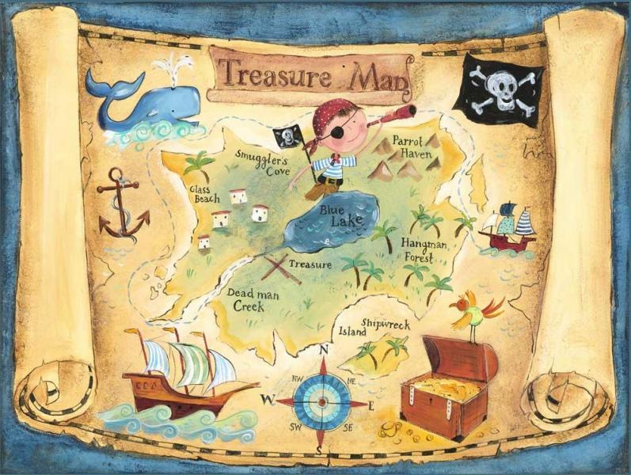
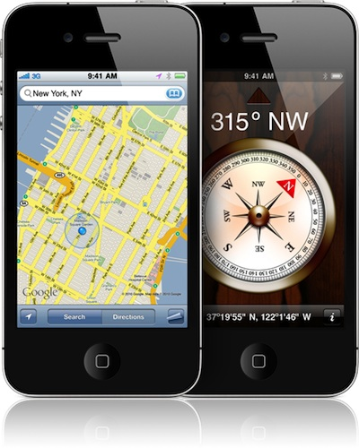
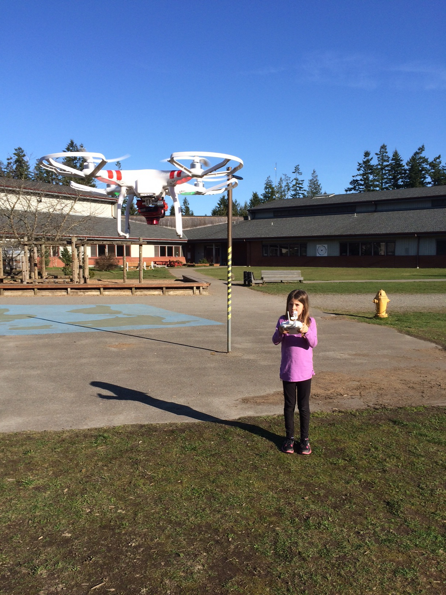
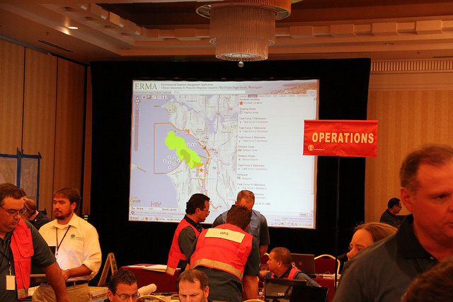
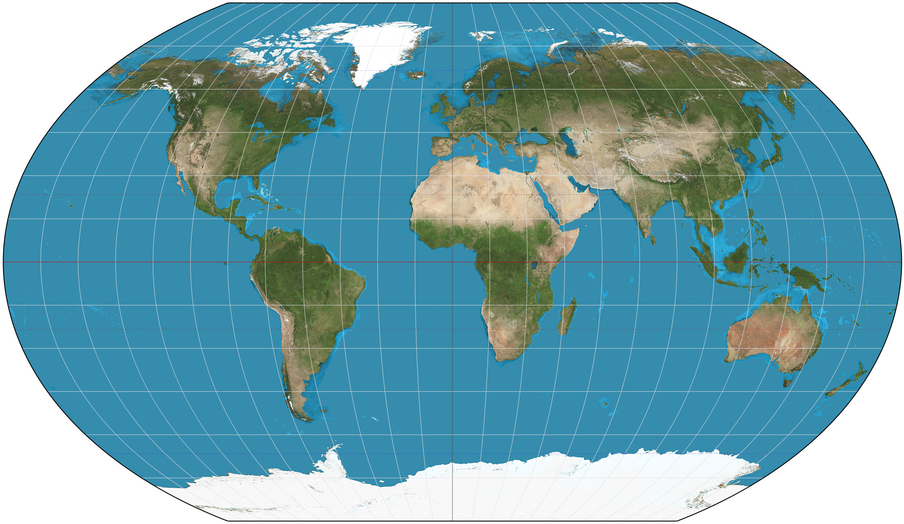
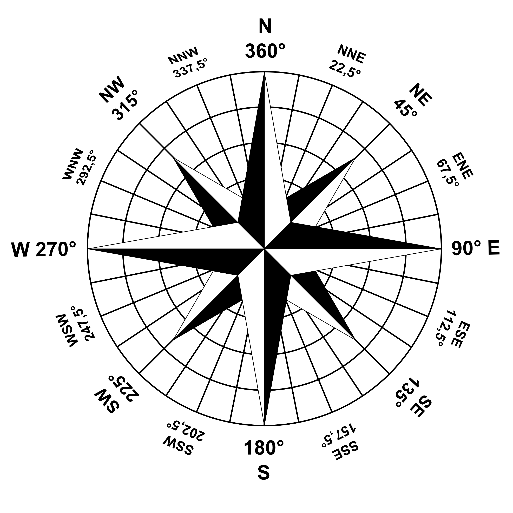
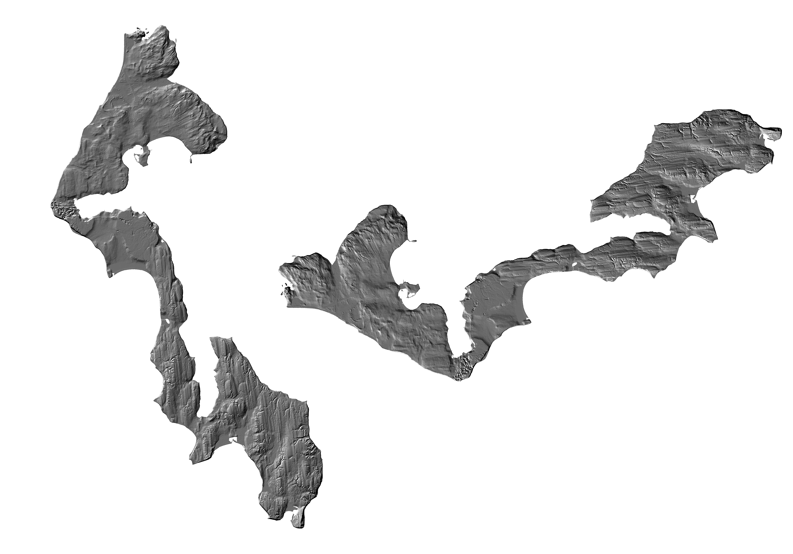
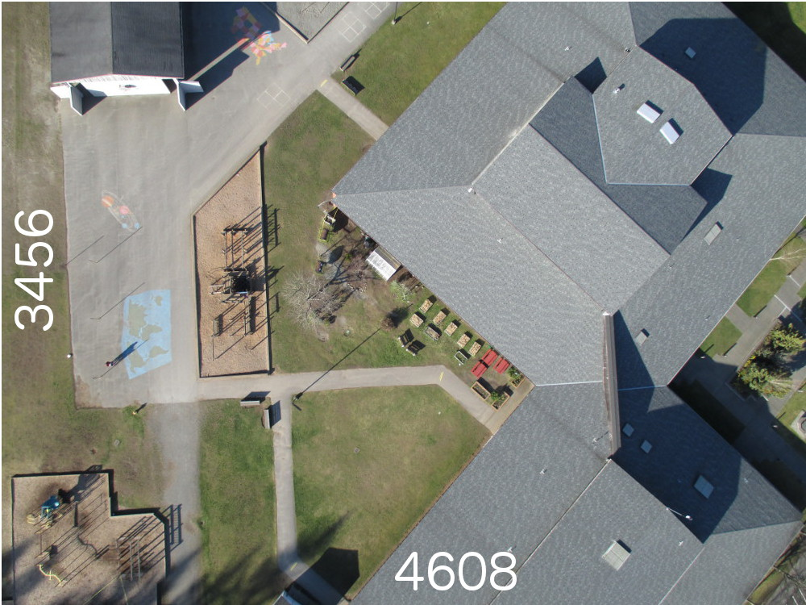
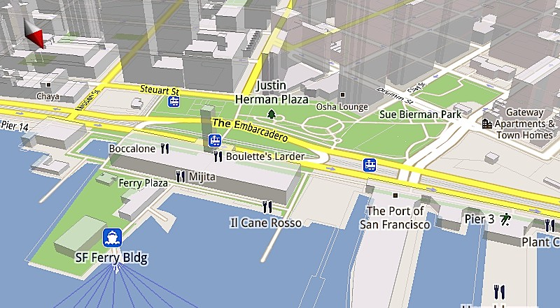
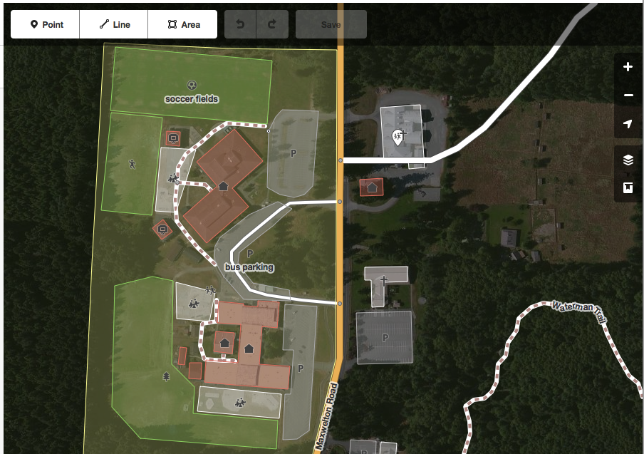

<!------------------------------------------------------------>
<!-- Topic: xxx -->

<h1>Maps!</h1>

<!------------------------------------------------------------>
--SLIDE--
<!-- Topic: Overview -->

<h2><b>Many</b> types of maps</h2>
Composite image of many maps here

--SUBSLIDE--

<h2>Maps are <b>everywhere</b></h2>

--SUBSLIDE--

<h2>Mapping is <b>fun</b></h2>

--SUBSLIDE--

<h2>Mapping can be your <b>job</b></h2>

<!------------------------------------------------------------>
--SLIDE--
<!-- Topic: Map Basics -->

<h1>Map Basics</h1>

--SUBSLIDE--

<h1>Orientation</h1>
<h2>North, South, East, West</h2>

--SUBSLIDE--

<h2>We like <b>North Up</b></h2>

--SUBSLIDE--

<h2>Flatten the globe</h2>
<iframe height="500px" width="1000px" src="http://bl.ocks.org/mbostock/raw/3711652/"></iframe>

--SUBSLIDE--

<h2>Look how <b>BIG</b> things   really are!</h2>
<iframe height="500px" width="1000px" src="http://www.jasondavies.com/maps/countries-by-area/"></iframe>

<!------------------------------------------------------------>
--SLIDE--
<!-- Topic: Data -->

<h2><b>Maps are layers</b></h2>

--SUBSLIDE--

<h1>Types of Data</h1>
<h2><b>Raster</b> and <b>Vector</b></h2>

--SUBSLIDE--

<h2><b>Raster</b> - Images</h2>

--SUBSLIDE--

<h2>"Mega Pixels"</h2>

<h3>4608 X 3456 = 15,925,248</h3>
<h3><b>16 million pixels!</b></h3>

--SUBSLIDE--

<h2><b>Vector</b> - Shapes</h2>

--SUBSLIDE--

<h2>Shapes, Shapes, Shapes</h2>

--SUBSLIDE--

<h2>Combine to <b>make</b> maps!</h2>

